# 📌 Active Directory & DNS Deployment using Azure VM

---

## 🧠 Overview

This project demonstrates the deployment and configuration of core enterprise infrastructure services using Windows Server 2016 on a Microsoft Azure Virtual Machine.

The focus is on setting up **Active Directory Domain Services (AD DS)** and **DNS**, followed by user and organizational unit management in a cloud-based environment.

---

## 🎯 Objectives

* Install and configure DNS Server
* Deploy Active Directory Domain Services (AD DS)
* Promote server to Domain Controller
* Manage Organizational Units (OUs)
* Create and manage user accounts

---

## 🛠️ Technologies Used

* Microsoft Azure Virtual Machine
* Windows Server 2016
* Active Directory Domain Services (AD DS)
* DNS Server

---
📸 Implementation & Screenshots

## 🖥️ Initial System Configuration  
  
Displays initial system configuration of the Azure VM, including IP settings and system status before setup.

---

## 🌐 DNS Server Installation  
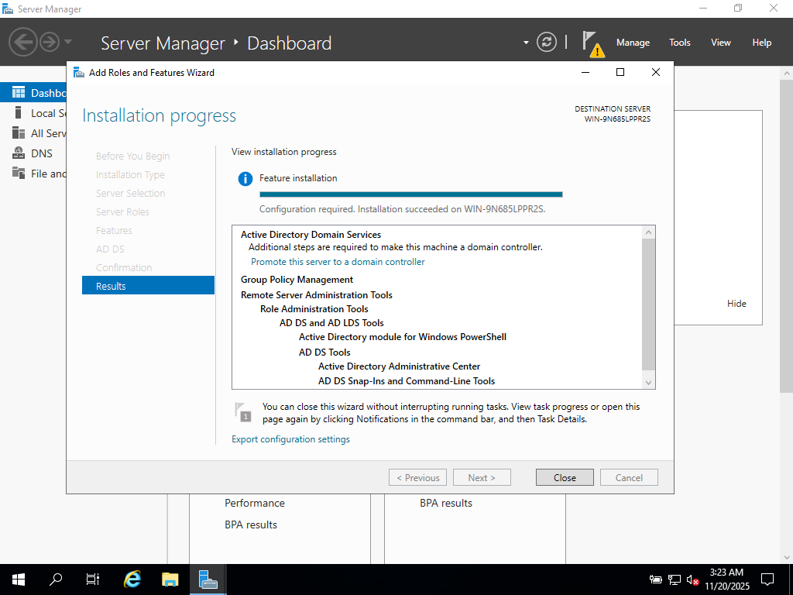  
Shows installation of the DNS Server role, enabling domain name resolution within the network.

---

## 🧠 Active Directory Installation  
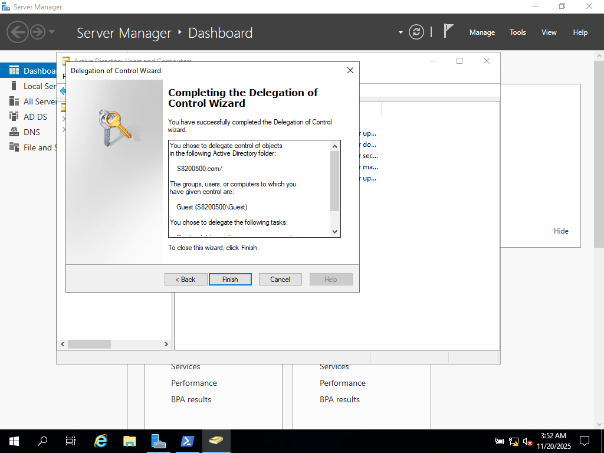  
Demonstrates installation of Active Directory Domain Services (AD DS).

---

## 🌲 Domain Controller Setup  
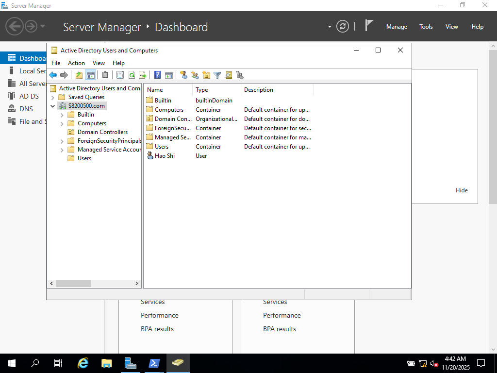  
Illustrates creation of a new domain forest and promotion of the server to a Domain Controller.

---

## ⚙️ Domain Configuration  
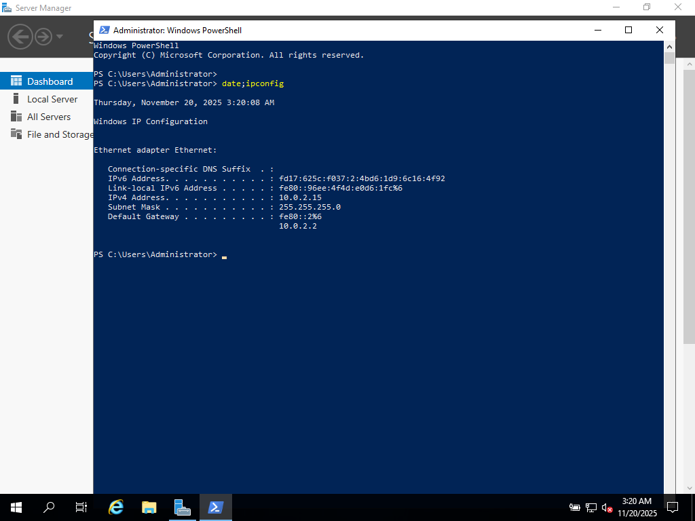  
Shows domain configuration settings including functional levels and directory paths.

---

## 🏢 Organizational Unit Creation  
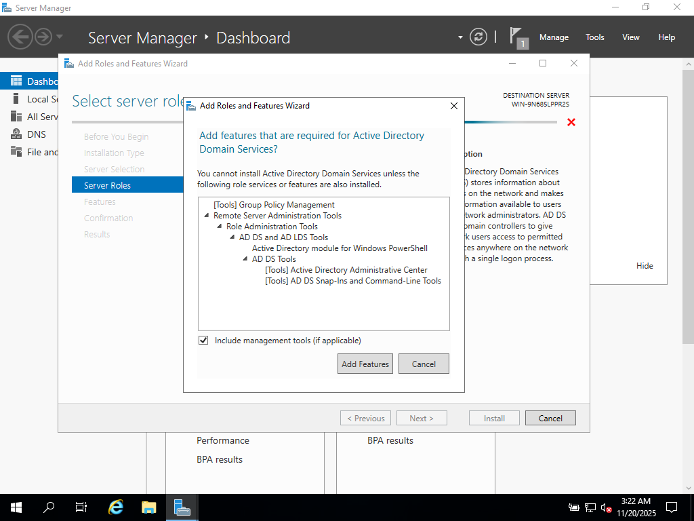  
Displays creation of Organizational Units (OUs) for structured management of users.

---

## 🔐 Delegation of Control  
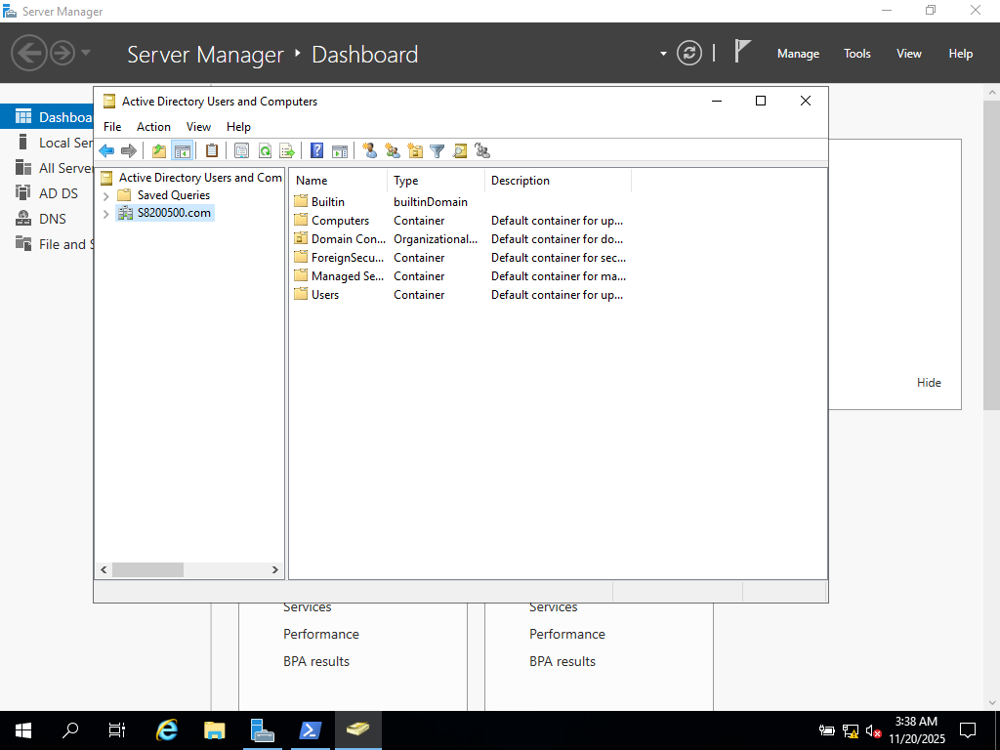  
Demonstrates delegation of administrative permissions within an OU.

---

## 👤 User Account Creation  
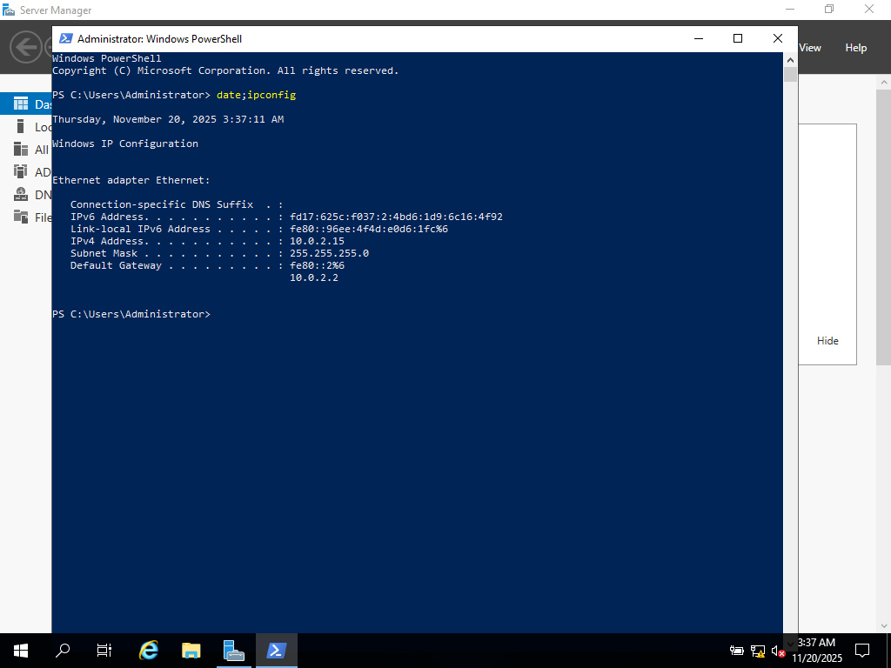  
Shows creation of a new user account in Active Directory.

---

## ✏️ User Configuration  
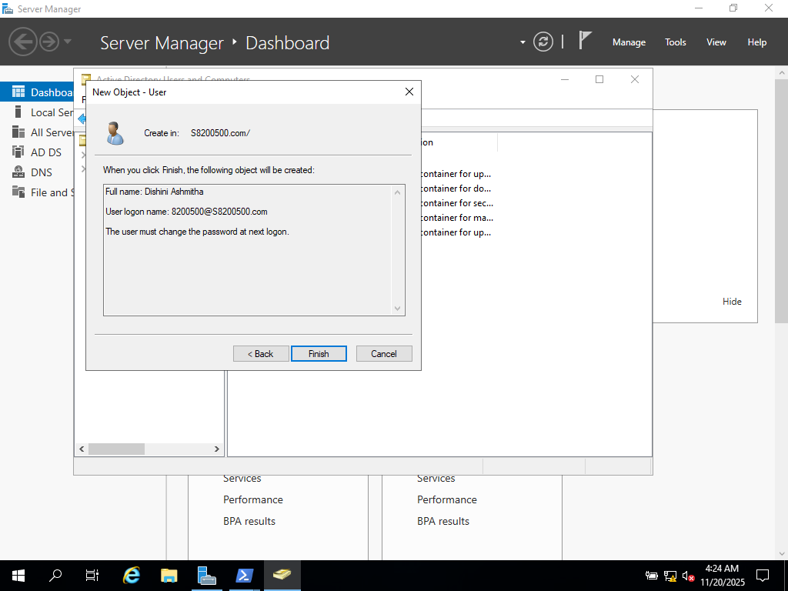  
Demonstrates modification of user account details such as name and login credentials.

---

## 📂 User Organization  
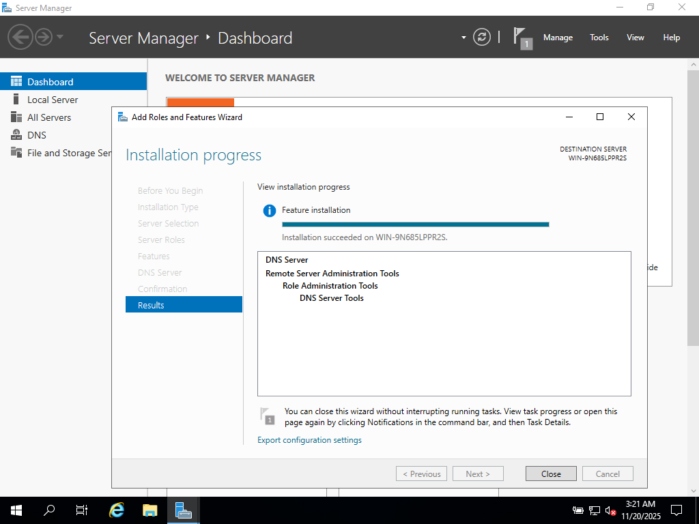  
Shows moving user accounts into Organizational Units for better structure.

---

## ⚙️ Additional Configuration  
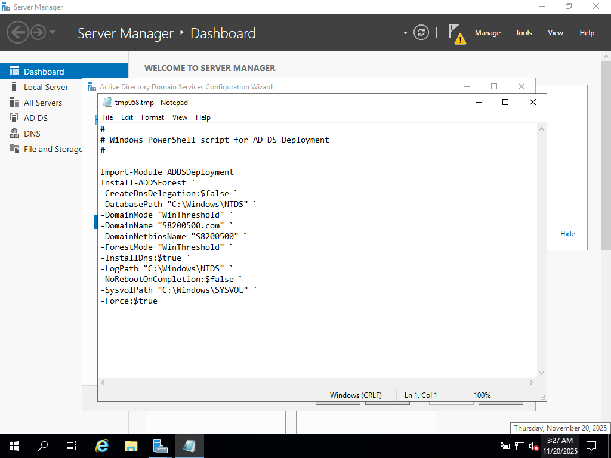  
Represents additional configuration steps during setup.

---

## 🔍 System Verification  
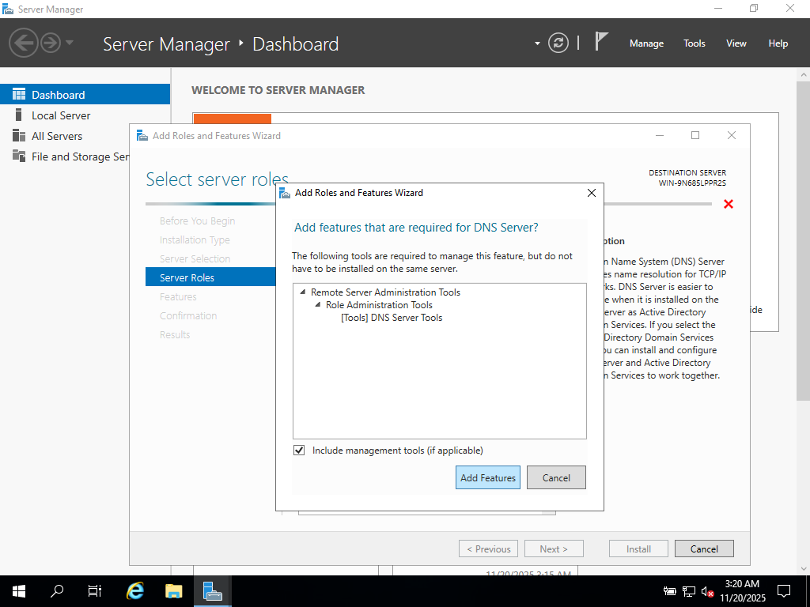  
Shows verification of successful installation and configuration.

---

## 🧩 Final Configuration  
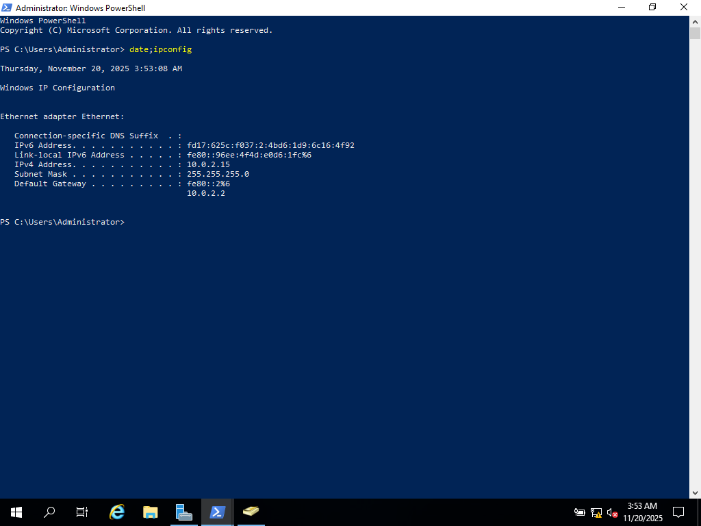  
Illustrates final stages of the Active Directory setup process.

---

## 📊 Environment Status  
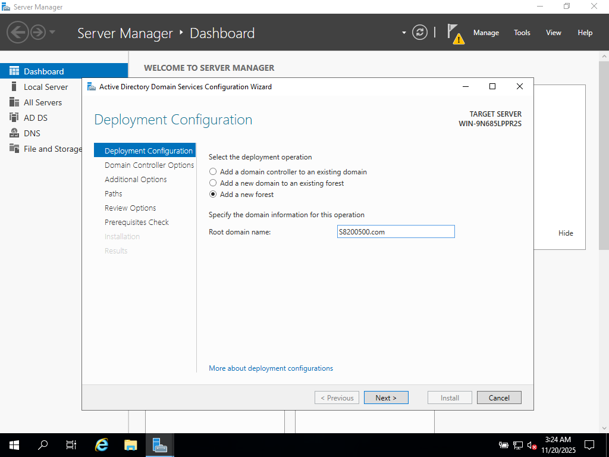  
Displays system status after completing configurations.

---

## ✅ Completed Setup  
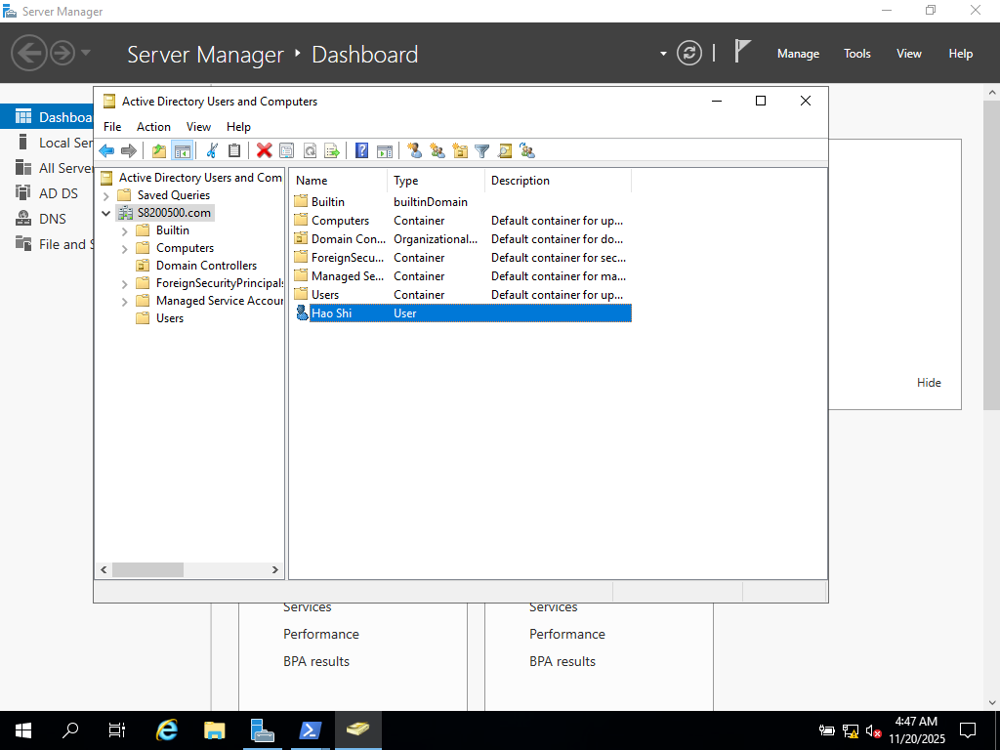  
Represents the fully configured Active Directory and DNS environment.

# 🚨 Key Outcomes

* Successfully deployed a domain-based network environment
* Configured DNS and Active Directory integration
* Implemented structured user and access management
* Simulated real-world enterprise infrastructure

---

# 💥 Real-World Relevance

* Reflects enterprise IT infrastructure
* Demonstrates identity and access management
* Shows hands-on cloud-based server deployment

---

# 🧠 Skills Demonstrated

* Active Directory Management
* DNS Configuration
* Windows Server Administration
* Cloud Infrastructure (Azure)
* User & Access Control

---

## ⚠️ Disclaimer

This project was completed as part of academic coursework in a controlled lab environment using Microsoft Azure.

---

